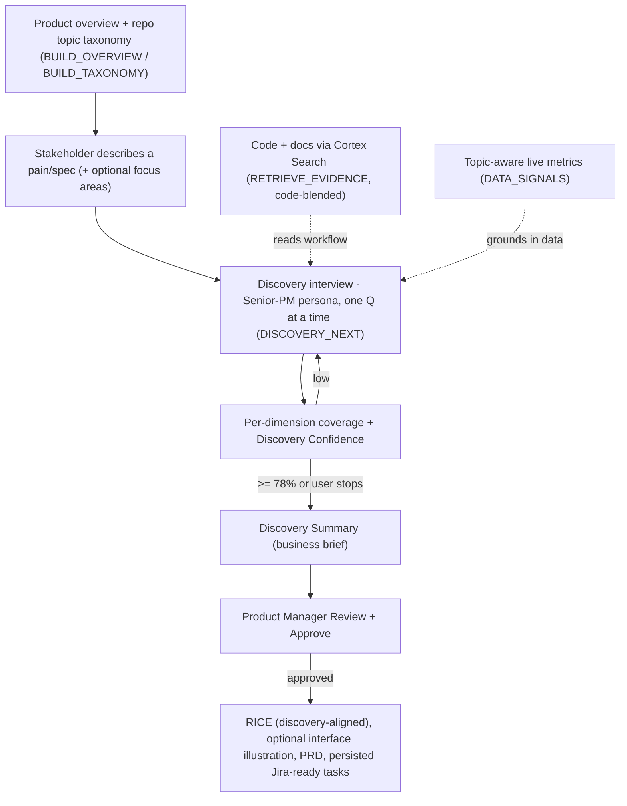

# Nomy Explores — AI Product Discovery Facilitator

A Snowflake-native **product discovery facilitator**. Business stakeholders describe a *pain* (or even a spec), and Nomy runs the discovery interview a **Senior Product Manager** would — grounded in the company's real code, docs, and data — so a PM can start planning without scheduling multiple discovery meetings.

> Snowflake CoCo CLI Hackathon — Category: **AI-Native Data Application**. The discovery is the product; the PRD is a downstream artifact.

## What makes it AI-native (not a chatbot / not basic RAG)

Every question Nomy asks is grounded in **three sources at once**, all inside Snowflake:

1. **The real codebase & docs** — Cortex Search over a normalized knowledge graph. Retrieval is *blended* to always include code files, so Nomy **reads the current workflow from the repo instead of asking** the stakeholder to describe implementation. Existing capabilities are detected before planning: Nomy investigates whether the remaining gap is discoverability, correctness, workflow fit, eligibility or adoption, and recommends **no new build only when the stakeholder confirms the current capability fully covers the need**.
2. **Live business data** — topic-aware metrics computed on the commerce tables (`DATA_SIGNALS`). A checkout question gets order-status numbers; an accounts question gets customer numbers; returns get return reasons. It **never invents numbers** and explicitly flags **data gaps** (e.g. carts/abandonment aren't captured) instead of asking the stakeholder to guess.
3. **The running transcript** — with per-dimension coverage + an overall Discovery Confidence.

It also **flags genuine contradictions** (a known weak spot — see [`EVAL.md`](EVAL.md)), keeps questions to what only the stakeholder knows (goal, pain, priorities), and gates the PRD/mock/tasks behind an explicit **PM review**.

## Flow



## Architecture (all Snowflake-native)

- **Operational plane** `PM_MEDIATOR.MOCK` — Medusa commerce tables (orders, customers, products, returns, refunds) + synthesized return/refund events; `COMMERCE_SV` semantic view for Cortex Analyst.
- **Knowledge plane** `PM_MEDIATOR.KNOWLEDGE` — normalized graph over code, docs, and GitHub issues; unified `KNOWLEDGE_SEARCH` Cortex Search service (auto-embedded `snowflake-arctic-embed-m-v1.5`); native Git repository object.
- **Discovery plane** `PM_MEDIATOR.DISCOVERY` — the SQL "agent skills", transcript/artifact tables, cached repo taxonomy & product overview, `@APP_STAGE`, and the Streamlit app (`DISCOVERY_WORKBENCH`).

Every Snowflake object is versioned as reproducible DDL in [`sql/`](sql/) (semantic view, Cortex Search, Cortex Agent, discovery skills, Git repository + refresh task) — see [`sql/README.md`](sql/README.md).

## Agent skills (reusable stored procedures / functions)

| Skill | Purpose |
|-------|---------|
| `DISCOVERY_NEXT` / `DISCOVERY_NEXT_V2` | Senior-PM brain: scores coverage + confidence, picks the single best next question, flags genuine contradictions, and detects already-built features. **V2 is the interactive path** — it takes a *compact structured state* + a *pre-computed* `DATA_SIGNALS` value + retrieved evidence (smaller prompt, no duplicate work). Both compute nothing via Cortex Search themselves; evidence is retrieved by the orchestrator and passed in |
| `CONTRADICTION_HINT(text)` | Deterministic pre-check for clearly incompatible frequency / scope / process statements; forces the contradiction flag so detection is reliable (no LLM dependence, no false positives) |
| `DATA_SIGNALS(text)` | Topic-aware live commerce metrics (accounts / checkout / fulfillment / catalog / returns / general), with honest data-gap notes. Computed **once per topic/session** and reused |
| `RETRIEVE_EVIDENCE(query, limit, type)` | Cortex Search over code/docs/issues; payload built with JSON functions (safe escaping). Retrieved **once at startup** (adaptive: one general search, code search only if needed) and reused |
| `SAVE_DISCOVERY_TURN` / `SAVE_DISCOVERY_ARTIFACTS` | Batched persistence: one `MERGE` per turn (preserves `CREATED_AT`, sets `UPDATED_AT`); artifacts saved in one `VARIANT`+`FLATTEN` call instead of one INSERT each |
| `MODEL()` | Single config point for the AI model used by every skill (currently `mistral-large2`) |
| `BUILD_TAXONOMY` | Analyzes the repo → 10 business-level topic areas (the start-screen focus picker) |
| `BUILD_OVERVIEW` | Neutral, data-grounded "what this product is" paragraph |
| `DISCOVERY_ARTIFACTS` | Synthesizes the PM-ready business brief from the transcript |
| `SCORE_RICE(topic, discovery_confidence)` | RICE = Reach × Impact × Confidence / Effort, with confidence aligned to the discovery and per-dimension Low/Med/High bands |
| `GENERATE_PRD` / `CREATE_TASKS` | Post-approval artifacts |

## Run

Snowsight → **Projects → Streamlit → `DISCOVERY_WORKBENCH`**. Read the product overview, optionally tag focus areas, describe a pain or spec, then answer each interview question (type an answer or pick a quick-answer chip, then **Answer**) and watch coverage/confidence rise. Send the summary to PM review to unlock RICE, the mock, the PRD, and tasks. The app runs fine under the least-privilege **`NOMY_APP_ROLE`** (see `sql/08_app_role.sql`) — **`ACCOUNTADMIN` is not required** for normal use; it's only used for the one-time admin setup.

Before a live demo, run `python warmup.py` to warm the warehouse and prime caches (the first cold call is otherwise slower; `AUTO_SUSPEND=600` keeps it warm ~10 min).

Runtime: Streamlit in Snowflake **1.49.1** on a warehouse runtime (pinned in `streamlit/environment.yml`).

## Reproduce

Scripts read credentials from environment variables (nothing machine- or user-specific is committed); key-pair auth is used for headless runs:

```bash
export SNOWFLAKE_ACCOUNT=<org-account>
export SNOWFLAKE_USER=<user>
export SNOWFLAKE_PRIVATE_KEY_FILE=./.keys/rsa_key.p8   # optional; defaults next to the scripts
# optional: MEDUSA_DUMP / MEDUSA_REPO / MEDUSA_DOCS to point at source inputs

python load_medusa.py                                 # load Medusa commerce tables (warehouse config = sql/00_warehouse.sql)
python gen_refunds.py                                 # seed the returns/refunds study case: synthetic
                                                      # return+refund events on 12% of the REAL orders
python index_code.py; python index_docs.py; python index_community.py  # build the knowledge graph (code, docs, issues)
# apply the Snowflake backend: run sql/00..08 in order (warehouse, semantic view, search, agent, skills, git, app role) - see sql/README.md
python deploy_app.py                                  # PUT app + environment.yml, CREATE STREAMLIT
python verify_discovery.py                            # non-destructive skill check
python eval.py                                        # controlled + end-to-end evaluation (writes EVAL.md)
python bench.py optimized                             # phase-level latency benchmark (appends Performance to EVAL.md)
python warmup.py                                      # warm the warehouse before a demo (read-only)
```

`gen_refunds.py` exists because the Medusa dev export ships the return/refund *tables* empty; it populates them with realistic, weighted events grounded in the real orders so the returns/refunds data-grounding (and the RICE returns case) has believable numbers.

## Evaluation

Two evaluation layers run against the **live** Snowflake backend (`python eval.py`, results in [`EVAL.md`](EVAL.md)):
- **Controlled reasoning** — handcrafted evidence is passed into `DISCOVERY_NEXT` to test a specific behavior deterministically (existing-capability detection, DATA-GAP honesty, off-topic avoidance, contradiction handling, unsupported-metric abstention, options-are-answers, no-repeat questioning).
- **End-to-end Snowflake pipeline** — a natural-language request → `RETRIEVE_EVIDENCE` (Cortex Search) → `DISCOVERY_NEXT` (live metrics via `DATA_SIGNALS`) → `DISCOVERY_ARTIFACTS` summary → artifact persistence, with **retrieval relevance** measured (an on-topic item must actually be retrieved — a non-empty result does not count).

Reported metrics include scenario pass rate, retrieval relevance, JSON/procedure success, data-grounding success, unsupported-metric abstention, and median end-to-end latency. Latest live run (2026-08-06): **16/16 scenarios passed** — controlled 13/13, end-to-end 3/3, 100% JSON/procedure success. Contradiction detection (previously the one miss) is now handled by a deterministic pre-check (`CONTRADICTION_HINT`) covering frequency / scope / process contradictions, verified to not false-flag a consistent case. See [`EVAL.md`](EVAL.md) for the full dated run.

## Performance

The interactive interview was optimized (see the Performance section of [`EVAL.md`](EVAL.md), measured with `bench.py`):
- **Evidence retrieved once** at startup (adaptive: one general Cortex Search, code search only if the general result lacks code) and reused; **live `DATA_SIGNALS` computed once per topic/session** and reused (the data panel renders the cached value instead of re-querying on every rerun).
- The AI receives a **compact structured state** (`DISCOVERY_NEXT_V2`) instead of the full growing transcript; the full transcript is still persisted for auditability.
- **Persistence is batched**: one `MERGE` per turn (deferred until after the reasoning result), and artifacts saved in a single `VARIANT`+`FLATTEN` call. This cut per-turn SQL round-trips and dropped summary-time artifact persistence from ~4.1s to ~0.6s (summary p50 ~13.6s → ~10.0s).
- **Honest limits:** the per-turn latency is dominated by the `AI_COMPLETE` call (`mistral-large2`, ~8–12s and variable in this region), so the aggressive interactive targets (next-question p50 ≤5s) are **not met** with the quality-passing model. A model benchmark found `llama3.1-8b` ~3× faster but only ~3/13 controlled scenarios pass (weak JSON), so it was **rejected** per the quality gate; `claude-3-5-haiku` is unavailable in this region. Cold vs warm latencies are reported separately in `EVAL.md`; latency targets are treated as goals, not claimed as achieved.

## Disclosures

- Real Medusa seed (orders / products / customers / prices); **return & refund events are synthesized on top of the real seed orders** (~12% return rate, real reason labels). This dev export does **not** include cart / checkout-session / promotion tables — the app surfaces that as a data gap rather than fabricating cart-abandonment numbers.
- Engineering tickets are generated from the PRD and **persisted as Jira-ready tasks in Snowflake** (`DISCOVERY.TASK`). The Jira board interaction is a **labeled demonstration** and does **not** call the real Jira REST API.
- **Runtime role:** the app runs under the least-privilege `NOMY_APP_ROLE` (`sql/08_app_role.sql`); `ACCOUNTADMIN` is only for one-time admin setup.
- **Performance honesty:** per-turn latency is bound by the `AI_COMPLETE` call (`mistral-large2`, ~8–12s, region-variable); the aggressive next-question p50≤5s target is not met with the quality-passing model (a ~3× faster `llama3.1-8b` failed the quality gate). Latency targets are goals, reported honestly in `EVAL.md`, not claimed as achieved.

## Built with CoCo CLI

Cortex Code (CoCo) was used to **build, orchestrate, and validate** the Snowflake resources — the schema, data loading, the `COMMERCE_SV` semantic view, the `KNOWLEDGE_SEARCH` service, the discovery skills, and the native Cortex Agent — using its skills (`semantic-view`, `search-optimization`, `cortex-agent`); a custom `product-discovery` CoCo skill encodes the workflow. At runtime the **Streamlit app is the orchestrator** that composes the SQL skills directly. The native `PRODUCT_DISCOVERY_AGENT` additionally exposes commerce Q&A (Cortex Analyst / `COMMERCE_SV`) and enterprise search (`KNOWLEDGE_SEARCH`) as reusable agent tools.
