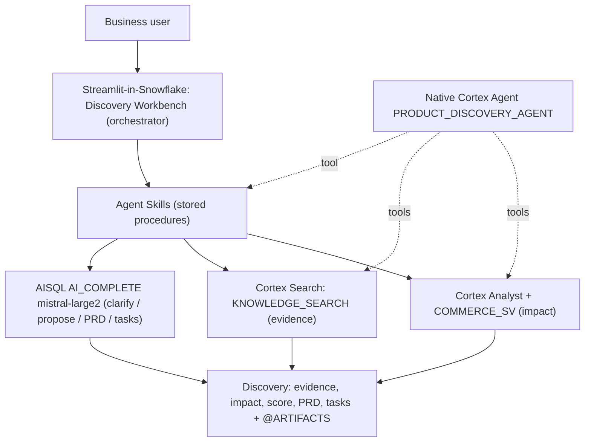

# AI Product Discovery Agent

A Snowflake-native **Product Manager mediator**: it turns a plain business request (e.g. *"I want refunds"* or *"put a tracker on each order journey"*) into an **evidence-grounded recommendation, a topic-aware mock interface, a PRD, and engineering tasks** — by orchestrating reusable Snowflake skills over enterprise **data + code + docs + community**.

> Snowflake CoCo CLI Hackathon — Category: **AI-Native Data Application**. Not a chatbot, not basic RAG.

## What it does

A business stakeholder types a request. The app, acting as a PM, runs an agentic loop:

1. **Quantifies impact** from governed data (Cortex Analyst / semantic view).
2. **Gathers cited evidence** across code, docs, and community (Cortex Search).
3. **Asks a clarifying question** when the request is ambiguous (human-in-the-loop).
4. **Scores the opportunity** with a transparent formula.
5. **Renders an existing-vs-proposed mock** of the real screen (product / checkout / order page), grounded in real data + the actual code file.
6. **Generates a PRD** and **engineering tasks** — the action — persisted with provenance.

## Architecture



Two data planes:
- **Operational** `PM_MEDIATOR.MOCK` — Medusa commerce tables + synthesized refund events; `COMMERCE_SV` semantic view.
- **Knowledge** `PM_MEDIATOR.KNOWLEDGE` — normalized supertype/subtype + graph model (code, docs, community, DB schema); unified `KNOWLEDGE_SEARCH`; native Git repository object; weekly refresh Task.
- **Skills + actions** `PM_MEDIATOR.DISCOVERY` — the Agent Skills, output tables, `@ARTIFACTS` stage, the native Cortex Agent, and the Streamlit app.

## Agent Skills (reusable, orchestrated — see `SKILLS.md`)

| Skill | Purpose | Snowflake service |
|-------|---------|-------------------|
| `QUANTIFY_IMPACT` | Topic-aware business metrics | SQL / semantic layer |
| `RETRIEVE_EVIDENCE` | Cited evidence for the request | Cortex Search |
| `CLARIFY_NEED` | Agentic gather-more-needs question | AISQL |
| `PROPOSE_FEATURE` | Evidence-grounded UI feature | AISQL |
| `SCORE_OPPORTUNITY` | Transparent score = impact x demand / effort | SQL |
| `GENERATE_PRD` | Engineering-ready PRD | AISQL |
| `CREATE_TASKS` | Split PRD into tickets (the action) | AISQL |

## Reproduce

Prereqs: a Snowflake account with Cortex, Python 3, and the `snowflake-connector-python` package. Scripts authenticate via key-pair (see notes in each script).

```bash
python load_medusa.py       # parse a Postgres pg_dump -> PM_MEDIATOR.MOCK tables
python gen_refunds.py        # synthesize refund/return events on the real orders
python index_code.py         # index the cloned repo into the knowledge graph
python index_docs.py         # index product docs (llms-full.txt)
python index_community.py    # index GitHub issues/discussions
# then create COMMERCE_SV, KNOWLEDGE_SEARCH, the DISCOVERY skills + agent (SQL),
python deploy_app.py         # PUT app to stage + CREATE STREAMLIT
python verify_skills.py      # non-destructive end-to-end skill check
```

## Run

Snowsight → **Projects → Streamlit → `DISCOVERY_WORKBENCH`** (role `ACCOUNTADMIN`). Type a request; impact + evidence + score + mock appear fast; PRD and tasks generate on demand; **Approve** persists tasks.

## Evaluation

- **Cortex Analyst accuracy: 3/3 (100%)** on an eval set (counts + total refund, refunds by reason, average refund all matched ground truth).
- **End-to-end skill orchestration verified** (all 7 skills; Opportunity Score 9.4/10 for the refund case).

## Disclosures

- The 1,200 orders / products / customers / prices are a real Medusa seed; **refund/return events were synthesized** on top of those real orders.
- The task "action" writes to a mock `TASK` table (stands in for Jira/Linear) — a documented, straightforward extension.
- GitLab MRs, Jira, APIs, and support tickets map cleanly into the knowledge model as new artifact types + connectors.

## Built with CoCo CLI

The entire system — schema, data loading, semantic view, Cortex Search services, the Agent Skills, the native Cortex Agent, and the Streamlit app — was designed, built, and self-verified through Cortex Code (CoCo), using its built-in skills (`semantic-view`, `search-optimization`, `cortex-agent`). A custom `product-discovery` CoCo skill encodes and orchestrates the workflow.
