# AI Product Discovery Facilitator

A Snowflake-native **Product Discovery facilitator**. Business stakeholders describe *pain*, not specs. This app runs the discovery interview a **Senior Product Manager** would — before a PM ever gets involved — so the PM can start planning without scheduling multiple discovery meetings.

> Snowflake CoCo CLI Hackathon — Category: **AI-Native Data Application**. The discovery is the product; the PRD is a downstream artifact.

## What it does

The AI acts as a Senior PM running a discovery workshop:

1. **Interviews** the stakeholder — one sharp question at a time, never accepting the first request at face value.
2. **Grounds questions in enterprise knowledge** (similar past requests, docs, tickets) to ask better questions and **detect duplicates/conflicts**.
3. **Tracks coverage + confidence** across 8 discovery dimensions and keeps asking until it understands the problem (or you say "I have enough").
4. **Builds business artifacts incrementally** — problem statement, business goal, stakeholders, personas, current workflow, pain points, success metrics, assumptions, constraints, risks, open questions, scope.
5. Produces a **Discovery Summary → Product Manager Review**. Only after PM approval does it unlock downstream artifacts (RICE, mock UI, PRD, tasks).

Success metric: *a PM can start implementation planning without multiple discovery meetings.*

## Flow

```mermaid
flowchart TD
  Idea["Business pain (not a spec)"] --> Interview["Discovery interview (Senior-PM persona, one Q at a time)"]
  KB["Enterprise knowledge (KNOWLEDGE_SEARCH): similar requests, docs, tickets"] -.informs.-> Interview
  Interview --> Conf["Per-dimension coverage + Discovery Confidence"]
  Conf -->|low| Interview
  Conf -->|>= 78% or user stops| Summary["Discovery Summary (business artifacts)"]
  Summary --> PM["Product Manager Review + Approve"]
  PM -->|approved| Artifacts["RICE, existing-vs-proposed mock, PRD, tasks"]
```



## Architecture (all Snowflake-native)
- **Operational plane** `PM_MEDIATOR.MOCK` — Medusa commerce tables + synthesized refund events; `COMMERCE_SV` semantic view.
- **Knowledge plane** `PM_MEDIATOR.KNOWLEDGE` — normalized graph (code, docs, community, DB schema); unified `KNOWLEDGE_SEARCH`; native Git repository object; weekly refresh Task.
- **Discovery** `PM_MEDIATOR.DISCOVERY` — the Agent Skills, transcript + artifact tables, `@ARTIFACTS` stage, a native Cortex Agent, and the Streamlit app.

## Agent Skills (reusable stored procedures — see `SKILLS.md`)

| Skill | Purpose |
|-------|---------|
| `DISCOVERY_NEXT` | Senior-PM brain: coverage + confidence + the single best next question, grounded in evidence; detects duplicates/conflicts |
| `DISCOVERY_ARTIFACTS` | Synthesizes the PM-ready business brief from the transcript |
| `RETRIEVE_EVIDENCE` | Enterprise knowledge search (similar requests, docs, tickets) |
| `QUANTIFY_IMPACT` | Topic-aware business metrics |
| `SCORE_RICE` | RICE score = Reach x Impact x Confidence / Effort |
| `GENERATE_PRD` | PRD (post-approval artifact) |
| `CREATE_TASKS` | Engineering tasks (post-approval artifact) |

## Run
Snowsight → **Projects → Streamlit → `DISCOVERY_WORKBENCH`** (role `ACCOUNTADMIN`). Describe a pain (e.g. *"Customers keep asking for refunds and support is overwhelmed"*), answer the interview questions (press Enter), watch the coverage bars and confidence rise, then send the summary to PM review.

## Reproduce
```bash
python load_medusa.py; python gen_refunds.py         # data
python index_code.py; python index_docs.py; python index_community.py   # knowledge graph
# create COMMERCE_SV, KNOWLEDGE_SEARCH, DISCOVERY skills + agent (SQL)
python deploy_app.py                                  # PUT app + CREATE STREAMLIT
python verify_discovery.py                            # non-destructive skill check
```

## Verification
- `DISCOVERY_NEXT` / `DISCOVERY_ARTIFACTS` verified end-to-end on a sample interview (rising confidence, relevant next question, duplicate detection, populated brief).
- Transcript/artifact persistence verified; Cortex Analyst accuracy 3/3 on the earlier metric eval.

## Disclosures
- Real Medusa seed (orders/products/customers/prices); **refund/return events synthesized** on the real orders.
- Downstream PRD/tasks write to a mock `TASK` table (Jira/Linear is a documented extension).

## Built with CoCo CLI
Designed, built, and self-verified through Cortex Code (CoCo), using its skills (`semantic-view`, `search-optimization`, `cortex-agent`). A custom `product-discovery` CoCo skill encodes the workflow.
