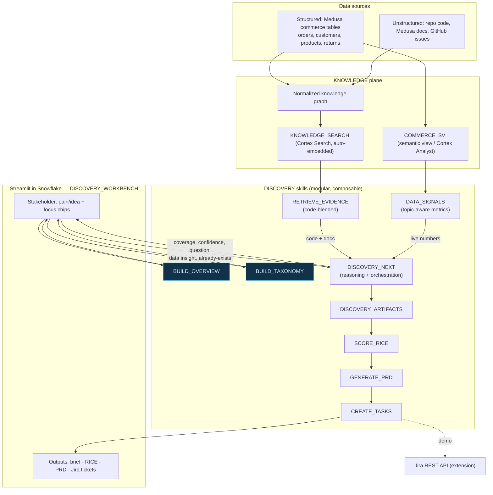

# Nomy Explores — Submission

**Hackathon:** Snowflake CoCo CLI Hackathon · **Category:** AI-Native Data Application
**App:** `PM_MEDIATOR.DISCOVERY.DISCOVERY_WORKBENCH` (Streamlit in Snowflake) · **Repo:** this repository

---

## 1. Problem Brief

**Real business problem.** Product discovery is a bottleneck. Business stakeholders raise requests as vague pains or half-baked specs ("add a voucher field", "build a contact page"). Product Managers then burn multiple meetings extracting the *real* problem, and decisions are often made without checking two things the company already has: **the codebase** (is this already built?) and **the data** (is this actually a problem, and how big?). The result is duplicated work, features nobody needed, and slow throughput.

**Target user / persona.**
- **Primary — Business stakeholder** (ops, marketing, support lead) who requests features but isn't a PM and doesn't know the implementation.
- **Secondary — Product Manager**, who receives a discovery-ready brief instead of a raw request and can plan immediately.
- **Beneficiary — Engineering**, who gets a grounded PRD and prioritized tickets instead of ambiguous asks.

**Current pain → improvement.** Today: several discovery meetings per idea, requests taken at face value, no data grounding, accidental rebuilds. With Nomy: an AI **Senior-PM facilitator** interviews the stakeholder up front, grounds every question in the **real code + live data + conversation**, flags features that already exist, debates contradictions, quantifies the opportunity (RICE), and outputs a PRD + Jira-ready tickets — so the PM starts planning without scheduling those meetings.

**Industry / domain.** Demonstrated on **e-commerce** (Medusa storefront + commerce data), but the pattern is domain-agnostic: any organization with code and data already in Snowflake can point Nomy at it.

---

## 2. Architecture Diagram

All components run natively in Snowflake (Cortex AISQL, Cortex Search, semantic views); the UI is Streamlit-in-Snowflake. Modular **skills** are SQL stored procedures/functions the app composes per step.

**Data flow — how the pieces plug together:**
1. **Ingest →** commerce data + code/docs/issues load into Snowflake; the knowledge graph feeds `KNOWLEDGE_SEARCH` (unstructured) and `COMMERCE_SV` (structured).
2. **Seed →** `BUILD_OVERVIEW` and `BUILD_TAXONOMY` analyze the repo once (cached) to produce the product overview and focus topics.
3. **Reason (per turn) →** the app orchestrator calls `RETRIEVE_EVIDENCE` (code-blended Cortex Search) and passes the results into `DISCOVERY_NEXT`, which computes `DATA_SIGNALS` (topic-routed live metrics) **internally**, combines evidence + data + transcript, and returns coverage, confidence, the next question, a data insight, and an existing-capability flag. (`DISCOVERY_NEXT` does not call Cortex Search itself.)
4. **Synthesize →** `DISCOVERY_ARTIFACTS` produces the business brief; PM approval gates the rest.
5. **Act →** `SCORE_RICE` (discovery-aligned), `GENERATE_PRD` (13-section, data-grounded), `CREATE_TASKS` (Jira-ready tickets).

**Cortex Code CLI skills / capabilities used** (each independently callable via SQL; the app is the primary orchestrator, and the commerce-Q&A + knowledge-search capabilities are also wired into the native `PRODUCT_DISCOVERY_AGENT`):

| Skill | Type | Role in the flow |
|-------|------|------------------|
| `BUILD_OVERVIEW` | proc | Repo → neutral "what this product is" overview (cached) |
| `BUILD_TAXONOMY` | proc | Repo → 10 business focus areas (start-screen chips) |
| `RETRIEVE_EVIDENCE` | proc | Cortex Search over code/docs/issues; returns content, blended to always include code |
| `DATA_SIGNALS` | function | Topic-aware live commerce metrics; flags data gaps honestly |
| `DISCOVERY_NEXT` | proc | Reasoning step: coverage + confidence + next question; computes live metrics via `DATA_SIGNALS` internally and uses code/doc evidence passed in by the app orchestrator |
| `DISCOVERY_ARTIFACTS` | proc | PM-ready business brief |
| `SCORE_RICE` | proc | RICE with discovery-aligned confidence + Low/Med/High bands |
| `GENERATE_PRD` | proc | Full 13-section, data-grounded PRD |
| `CREATE_TASKS` | proc | Jira-ready tickets (type, area, priority, story points) |

**Data sources:** *structured* — Medusa commerce tables (orders, customers, products, returns/refunds) + `COMMERCE_SV`; *unstructured* — repository code, Medusa documentation, GitHub issues, unified in `KNOWLEDGE_SEARCH`.

Every Snowflake object is versioned as reproducible DDL in [`sql/`](sql/) — `COMMERCE_SV`, `KNOWLEDGE_SEARCH`, `PRODUCT_DISCOVERY_AGENT`, the discovery skills, and the `DTC_STARTER_REPO` Git object + `REFRESH_GIT` task (see [`sql/README.md`](sql/README.md)).

---

## 3. Impact Statement

**Measurable outcomes**
- **Discovery cycle time (target):** aims to reduce discovery from an assumed baseline of **3–5 stakeholder/PM meetings** per idea to one facilitated self-serve session plus a PM review, producing a PM-ready brief + PRD + tickets. (Target, not yet validated with a pilot — see below.)
- **Fewer wrong/duplicate builds:** every request is checked against the **actual codebase**; already-built features (e.g., the existing checkout promotion-code input) are detected before planning, and Nomy investigates the specific gap (discoverability, correctness, workflow fit, eligibility, adoption) rather than auto-stopping — recommending no new build only when the stakeholder confirms the current capability fully covers the need.
- **Decisions grounded in real data:** questions and prioritization cite live numbers (e.g., **1,200 orders, 527 not-completed (44%), 101 in `requires_action`, 144 returns**) instead of opinions; when data is missing (no cart/abandonment tables) it is flagged as a gap rather than guessed.
- **Consistency:** every idea yields the same structured artifacts (8-dimension coverage, RICE with bands, 13-section PRD, estimated tickets), reducing brief-quality variance across PMs.

**Scalability potential**
- Runs entirely on Snowflake compute (warehouse runtime, auto-suspend); scales with the account, no external infra.
- Point it at **any repo + any data** in Snowflake — re-run `BUILD_TAXONOMY` / `BUILD_OVERVIEW` and the focus areas and grounding adapt automatically (multi-repo/topic ready).
- Cortex Search + semantic views handle growing corpora; skills are stateless and composable.

**Beyond the demo**
- **Real integrations:** swap the demo Jira cards for the **Jira REST API**; connect a live **Git repository** object with continuous doc/issue sync.
- **Free NL data Q&A:** surface `COMMERCE_SV` via **Cortex Analyst** so stakeholders can also ask ad-hoc data questions mid-discovery.
- **Governance & memory:** persist discoveries, dedupe against past sessions, and feed approved PRDs into delivery tooling — turning one-off discovery into an organizational knowledge loop.

---

## Evaluation (reproducible)
`python eval.py` runs **two layers** against the live Snowflake backend and writes [`EVAL.md`](EVAL.md):
- **Controlled reasoning** — handcrafted evidence passed into `DISCOVERY_NEXT` to test a specific behavior deterministically (existing-capability detection, DATA-GAP honesty, off-topic avoidance, contradiction handling with no false positives, unsupported-metric abstention, options-are-answers, no-repeat questioning).
- **End-to-end Snowflake pipeline** — a natural-language request → `RETRIEVE_EVIDENCE` (Cortex Search) → `DISCOVERY_NEXT` (live metrics via `DATA_SIGNALS`) → `DISCOVERY_ARTIFACTS` summary → artifact persistence, with **retrieval relevance** measured (an on-topic item must actually be retrieved; a non-empty result does not count).

See [`EVAL.md`](EVAL.md) for the current dated run (scenario pass rate, retrieval relevance, JSON/procedure success, data-grounding, unsupported-metric abstention, median end-to-end latency). The evaluation contains **both controlled-evidence and true end-to-end retrieval scenarios**; any failing scenario (e.g., a frequency contradiction not flagged) is reported honestly rather than hidden.

## Honest disclosures
- Real Medusa seed (orders/products/customers/prices); **return & refund events are synthesized** on the real orders (~12% return rate, real reason labels). This dev export does not include cart/checkout-session/promotion tables — the app surfaces that as a data gap rather than fabricating cart-abandonment numbers.
- Engineering tickets are generated from the PRD and **persisted as Jira-ready tasks in Snowflake** (`DISCOVERY.TASK`, with type/area/priority/points). The Jira board interaction is a **clearly labeled demonstration** and does **not** call the real Jira REST API.

## Built with CoCo CLI
Cortex Code (CoCo) was used to **build, orchestrate, and validate** the Snowflake resources — schema, data loading, the semantic view, the `KNOWLEDGE_SEARCH` service, all DISCOVERY skills, and the native Cortex Agent — using its skills (`semantic-view`, `search-optimization`, `cortex-agent`); a custom `product-discovery` CoCo skill encodes the workflow. At runtime the **Streamlit app is the orchestrator** that composes the SQL skills directly; the native `PRODUCT_DISCOVERY_AGENT` additionally exposes commerce Q&A and enterprise search as reusable tools. Reproducible scripts: `load_medusa.py`, `gen_refunds.py`, `index_*.py`, `deploy_app.py`, plus the ordered DDL in `sql/` (`01..07`).
